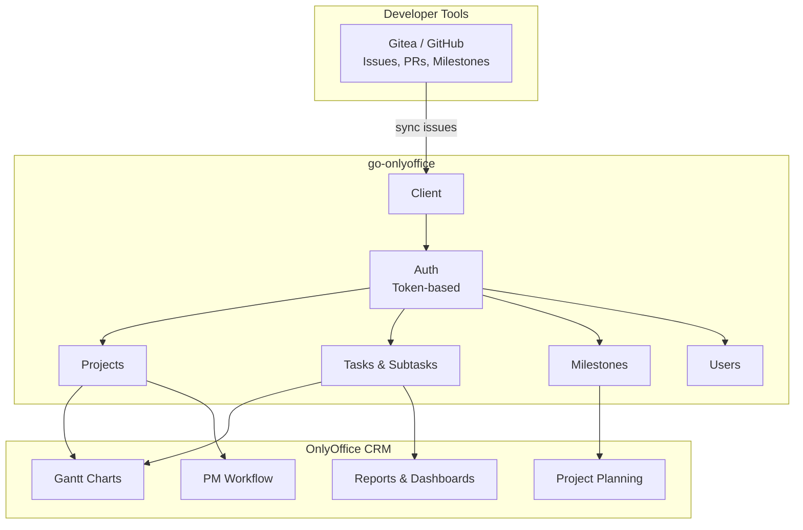
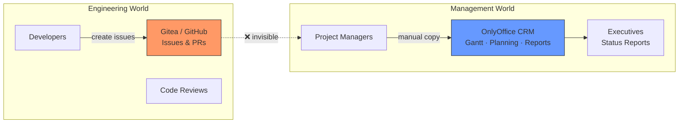
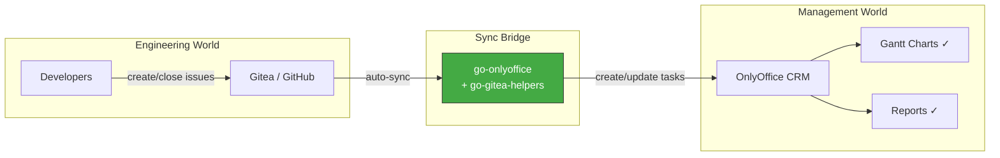
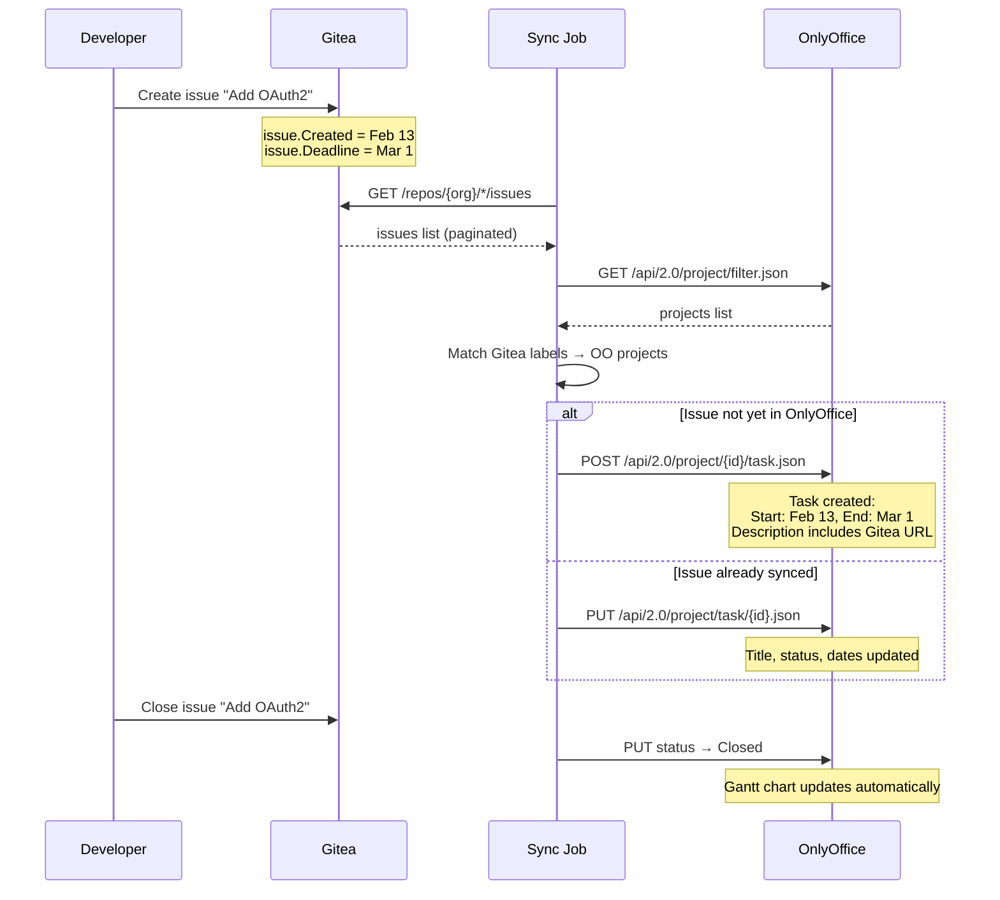
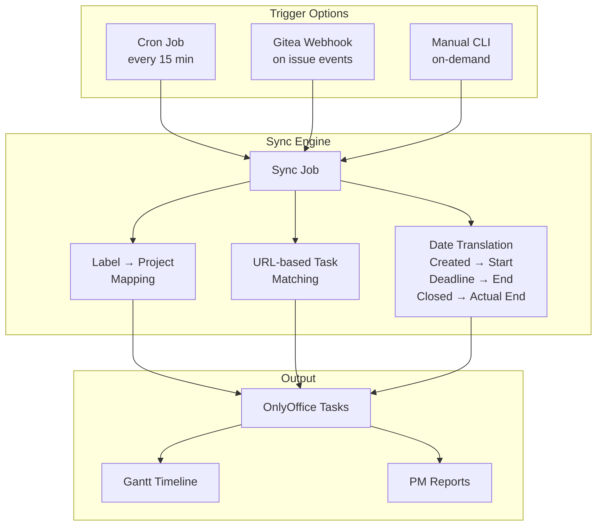

# go-onlyoffice

[](https://pkg.go.dev/github.com/eslider/go-onlyoffice)
[](https://opensource.org/licenses/MIT)
[](https://go.dev)
[](https://github.com/eSlider/go-onlyoffice/releases)
[](https://github.com/eSlider/go-onlyoffice/stargazers)

Go client library for the [OnlyOffice](https://www.onlyoffice.com/) Project Management API — manage projects, tasks, subtasks, milestones, and users programmatically.

Pairs with [go-gitea-helpers](https://github.com/eSlider/go-gitea-helpers) to bridge developer issue trackers with CRM-grade project management for Gantt charts, resource planning, and executive reporting.

## Architecture



## The Problem: Developers vs. Project Managers



**Without sync:** Project managers manually copy issue titles, deadlines, and status from Gitea into OnlyOffice. Developers don't update the CRM. Gantt charts rot. Reports lie.

**With sync:** Issues flow automatically from Gitea to OnlyOffice with start dates, deadlines, and status. PMs get live Gantt charts. Developers keep working in Git.



## Installation

```bash
go get github.com/eslider/go-onlyoffice
```

For Gitea sync (optional):

```bash
go get github.com/eslider/go-gitea-helpers
```

## Quick Start

### Connect and List Projects

```go
client := onlyoffice.NewClient(onlyoffice.GetEnvironmentCredentials())

projects, _ := client.GetProjects()
for _, p := range projects {
    fmt.Printf("[%d] %s — %d tasks\n", *p.ID, *p.Title, safeInt(p.TaskCountTotal))
}
```

### Create a Project with Tasks and Deadlines

```go
// Create a project
project, _ := client.CreateProject(onlyoffice.NewProjectRequest{
    Title:       "Q1 2026 Release",
    Description: "Backend API v2 + mobile app redesign",
})

// Create tasks with start/end dates (for Gantt chart)
client.CreateProjectTask(onlyoffice.NewProjectTaskRequest{
    ProjectId:   *project.ID,
    Title:       "Design API schema",
    Description: "OpenAPI 3.1 spec for all endpoints",
    StartDate:   onlyoffice.Time(time.Now()),
    Deadline:    onlyoffice.Time(time.Now().AddDate(0, 0, 14)),
    Priority:    1, // High
})

client.CreateProjectTask(onlyoffice.NewProjectTaskRequest{
    ProjectId:   *project.ID,
    Title:       "Implement auth service",
    Description: "JWT + OAuth2 + refresh tokens",
    StartDate:   onlyoffice.Time(time.Now().AddDate(0, 0, 14)),
    Deadline:    onlyoffice.Time(time.Now().AddDate(0, 1, 0)),
})
```

### List and Filter Tasks

```go
// Get all tasks for a project
tasks, _ := client.GetTasks(onlyoffice.NewProjectGetTasksRequest(*project.ID))

for _, t := range tasks {
    status := "open"
    if t.Status != nil && *t.Status == onlyoffice.ProjectTaskStatusClosed {
        status = "closed"
    }
    fmt.Printf("  [%s] %s", status, *t.Title)
    if t.Deadline != nil {
        fmt.Printf(" (due: %s)", t.Deadline.Format("2006-01-02"))
    }
    fmt.Println()
}
```

### Update Task Status and Dates

```go
// Close a task and set actual end date
client.UpdateProjectTask(onlyoffice.ProjectTaskUpdateRequest{
    ID:       taskID,
    Title:    "Design API schema",
    Status:   onlyoffice.ProjectTaskStatusClosed,
    Deadline: &onlyoffice.Time(time.Now()),
})
```

### Get Milestones and Task Progress

```go
milestones, _ := client.GetProjectMilestones(project)
for _, ms := range milestones {
    active := int64(0)
    closed := int64(0)
    if ms.ActiveTaskCount != nil { active = *ms.ActiveTaskCount }
    if ms.ClosedTaskCount != nil { closed = *ms.ClosedTaskCount }
    total := active + closed

    fmt.Printf("Milestone: %s — %d/%d tasks done", *ms.Title, closed, total)
    if ms.Deadline != nil {
        fmt.Printf(" (deadline: %s)", ms.Deadline.Format("2006-01-02"))
    }
    fmt.Println()
}
```

---

## Use Case: Gitea → OnlyOffice Sync

The primary use case is **bridging developer workflows with project management**. Developers create issues in Gitea; a sync job automatically mirrors them as OnlyOffice tasks with proper start/end dates, enabling PMs to work with Gantt charts without developers leaving their Git workflow.

### Sync Flow



### Sync Example

```go
package main

import (
    "fmt"
    "log"
    "os"
    "strings"

    gitea "github.com/eslider/go-gitea-helpers"
    onlyoffice "github.com/eslider/go-onlyoffice"
)

func main() {
    // Connect to both services
    oo := onlyoffice.NewClient(onlyoffice.GetEnvironmentCredentials())
    gc, _ := gitea.NewClient(gitea.GetEnvironmentConfig())
    owner := os.Getenv("GITEA_OWNER")

    // Load all Gitea issues and OnlyOffice projects
    repos, _ := gc.GetAllReposIssues(owner)
    projects, _ := oo.GetProjects()

    for repoName, repo := range repos {
        // Find matching OnlyOffice project by name
        project := projects.Get(repoName)
        if project == nil {
            fmt.Printf("SKIP %s (no matching OO project)\n", repoName)
            continue
        }

        // Load existing tasks
        tasks, _ := oo.GetTasks(onlyoffice.NewProjectGetTasksRequest(*project.ID))

        for _, issue := range repo.Issues {
            // Check if issue is already synced (URL in description)
            existing := findSyncedTask(tasks, issue.HTMLURL)

            if existing != nil {
                // Update existing task
                status := onlyoffice.ProjectTaskStatusOpen
                if issue.State == "closed" {
                    status = onlyoffice.ProjectTaskStatusClosed
                }

                oo.UpdateProjectTask(onlyoffice.ProjectTaskUpdateRequest{
                    ID:        *existing.ID,
                    Title:     issue.Title,
                    Status:    status,
                    StartDate: timePtr(onlyoffice.Time(issue.Created)),
                    Deadline:  deadlineFromIssue(issue),
                })
                fmt.Printf("  UPDATED: %s\n", issue.Title)
            } else {
                // Create new task
                status := onlyoffice.ProjectTaskStatusOpen
                if issue.State == "closed" {
                    status = onlyoffice.ProjectTaskStatusClosed
                }

                oo.CreateProjectTask(onlyoffice.NewProjectTaskRequest{
                    ProjectId:   *project.ID,
                    Title:       issue.Title,
                    Description: issue.Body + "\n\nURL:" + issue.HTMLURL,
                    StartDate:   onlyoffice.Time(issue.Created),
                    Deadline:    *deadlineFromIssue(issue),
                    Status:      status,
                })
                fmt.Printf("  CREATED: %s\n", issue.Title)
            }
        }
    }
}

// findSyncedTask checks task descriptions for the Gitea issue URL.
func findSyncedTask(tasks []*onlyoffice.Task, issueURL string) *onlyoffice.Task {
    for _, t := range tasks {
        if t.Description != nil && strings.Contains(*t.Description, issueURL) {
            return t
        }
    }
    return nil
}
```

### What Project Managers Get

Once synced, OnlyOffice provides without any developer intervention:

| Feature | How It Works |
|---|---|
| **Gantt Charts** | Tasks have `StartDate` and `Deadline` from Gitea issue created/due dates |
| **Status Tracking** | Open/closed status mirrors Gitea issue state in real time |
| **Milestone Planning** | Gitea milestones map to OnlyOffice milestones with progress % |
| **Resource Allocation** | Task assignees sync so PMs see who's working on what |
| **Sprint Reports** | Filter by date range to generate sprint/release reports |
| **Cross-Repo View** | All repos' issues appear as tasks in a unified project board |
| **Executive Dashboards** | Project progress, overdue tasks, team workload at a glance |

### Recommended Sync Architecture



---

## Use Case: Task Lifecycle Management

### Creating Tasks with Full Metadata

```go
task, _ := client.CreateProjectTask(onlyoffice.NewProjectTaskRequest{
    ProjectId:   projectID,
    Title:       "Implement payment gateway",
    Description: "Integrate Stripe API for subscription billing",
    StartDate:   onlyoffice.Time(time.Date(2026, 3, 1, 0, 0, 0, 0, time.UTC)),
    Deadline:    onlyoffice.Time(time.Date(2026, 3, 15, 0, 0, 0, 0, time.UTC)),
    Priority:    1, // High
    MilestoneId: milestoneID,
    Notify:      true,
})
```

### Tracking Task Progress

```go
tasks, _ := client.GetTasks(onlyoffice.NewProjectGetTasksRequest(projectID))

open, closed := 0, 0
var overdue []*onlyoffice.Task

for _, t := range tasks {
    if t.Status != nil && *t.Status == onlyoffice.ProjectTaskStatusClosed {
        closed++
    } else {
        open++
        if t.Deadline != nil && t.Deadline.Before(time.Now()) {
            overdue = append(overdue, t)
        }
    }
}

fmt.Printf("Progress: %d/%d done (%.0f%%)\n", closed, open+closed,
    float64(closed)/float64(open+closed)*100)

if len(overdue) > 0 {
    fmt.Printf("⚠ %d overdue tasks:\n", len(overdue))
    for _, t := range overdue {
        fmt.Printf("  - %s (due: %s)\n", *t.Title, t.Deadline.Format("2006-01-02"))
    }
}
```

### Subtask Management

Tasks support subtasks for breaking work into smaller pieces:

```go
type Task struct {
    ID           *int          `json:"id"`
    Title        *string       `json:"title"`
    StartDate    *time.Time    `json:"startDate"`
    Deadline     *time.Time    `json:"deadline"`
    Description  *string       `json:"description"`
    Priority     *int          `json:"priority"`       // High=1, Normal=0, Low=-1
    Status       *ProjectTaskStatus `json:"status"`    // Open=1, Closed=2
    Subtasks     []any         `json:"subtasks"`
    MilestoneID  *int64        `json:"milestoneId"`
    Responsibles []*User       `json:"responsibles"`   // Assigned team members
    // ... timestamps, permissions
}
```

---

## API Reference

### Client

| Function | Description |
|---|---|
| `NewClient(credentials)` | Create a new API client |
| `GetEnvironmentCredentials()` | Load from `ONLYOFFICE_*` env vars |
| `Auth(credentials)` | Authenticate and get token |
| `Query(request, result)` | Execute raw API request |

### Projects

| Method | Description |
|---|---|
| `GetProjects()` | List all projects |
| `CreateProject(req)` | Create a new project |
| `UpdateProject(req)` | Update project details |
| `DeleteProject(id)` | Delete a project |
| `GetProjectMilestones(project)` | Get milestones with task counts |

### Tasks

| Method | Description |
|---|---|
| `GetTasks(req)` | List tasks with filtering |
| `CreateProjectTask(req)` | Create task with dates, priority, milestone |
| `UpdateProjectTask(req)` | Update title, status, dates, priority |

### Task Fields for Gantt

| Field | Type | Purpose |
|---|---|---|
| `StartDate` | `*time.Time` | Gantt bar start |
| `Deadline` | `*time.Time` | Gantt bar end |
| `Status` | `ProjectTaskStatus` | Open (1) / Closed (2) |
| `Priority` | `*int` | High (1) / Normal (0) / Low (-1) |
| `MilestoneID` | `*int64` | Groups tasks under milestones |
| `Responsibles` | `[]*User` | Assigned team members |
| `Subtasks` | `[]any` | Sub-items within a task |

### Users

| Method | Description |
|---|---|
| `GetUsers()` | List all users with profiles |

### Helper Types

| Type | Description |
|---|---|
| `Projects` | `[]*Project` with `.Get(title)` lookup |
| `Time` | `time.Time` wrapper with OnlyOffice JSON format |
| `Task.GetGiteaIssueLink()` | Extract Gitea URL from task description |

## Environment Variables

| Variable | Description |
|---|---|
| `ONLYOFFICE_URL` | OnlyOffice instance URL |
| `ONLYOFFICE_USER` | Login email or username |
| `ONLYOFFICE_PASS` | Password |

## Examples

| Example | Description |
|---|---|
| [basic](examples/basic/) | List projects and users |

## Related Libraries

| Library | Description |
|---|---|
| [go-gitea-helpers](https://github.com/eSlider/go-gitea-helpers) | Gitea pagination helpers for issue/repo fetching |
| [go-matrix-bot](https://github.com/eSlider/go-matrix-bot) | Matrix bot with OnlyOffice task creation from chat |
| [go-trade](https://github.com/eSlider/go-trade) | Unified trade data model across exchanges |

## License

[MIT](LICENSE)
