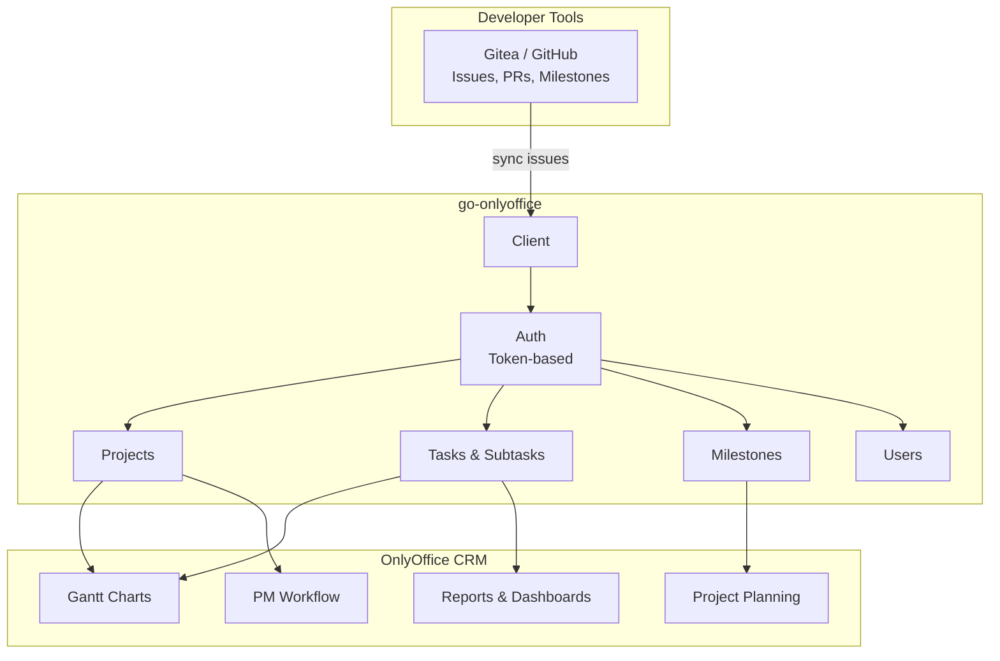
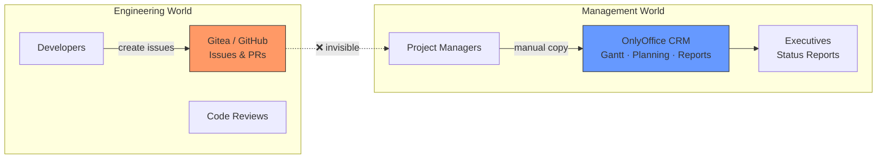
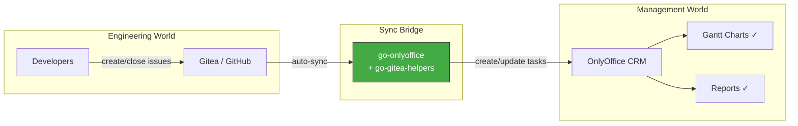
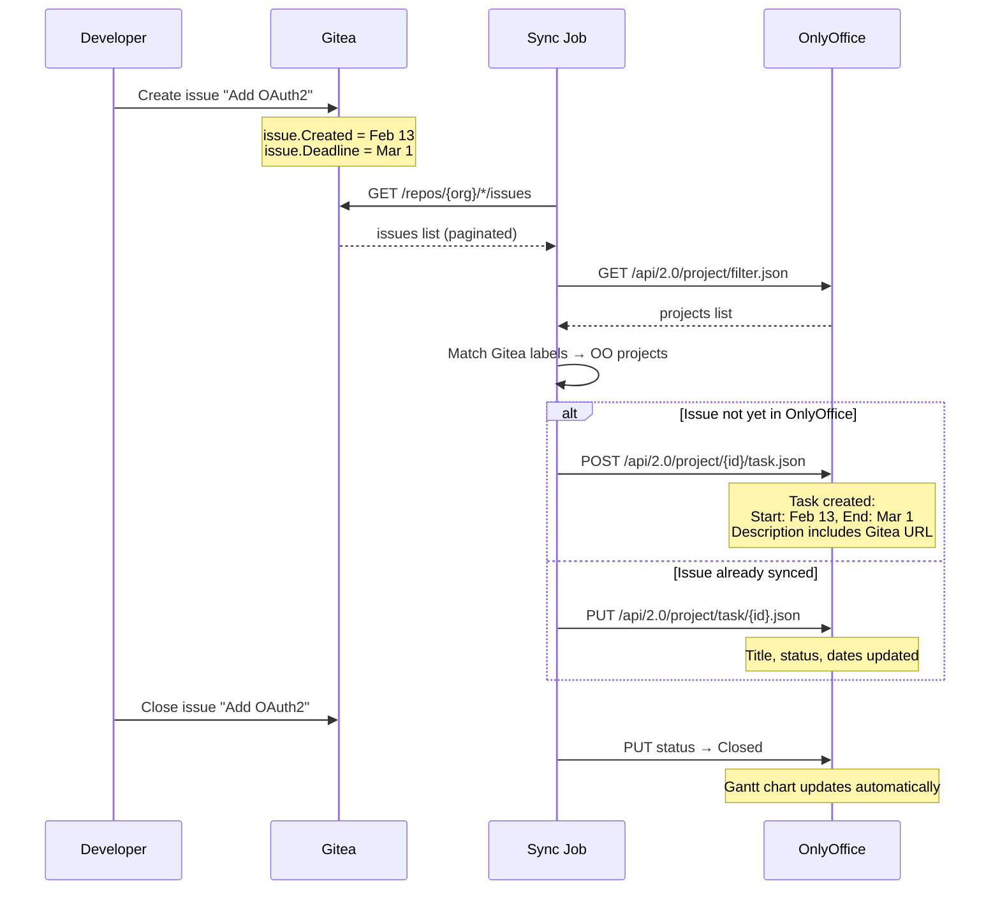
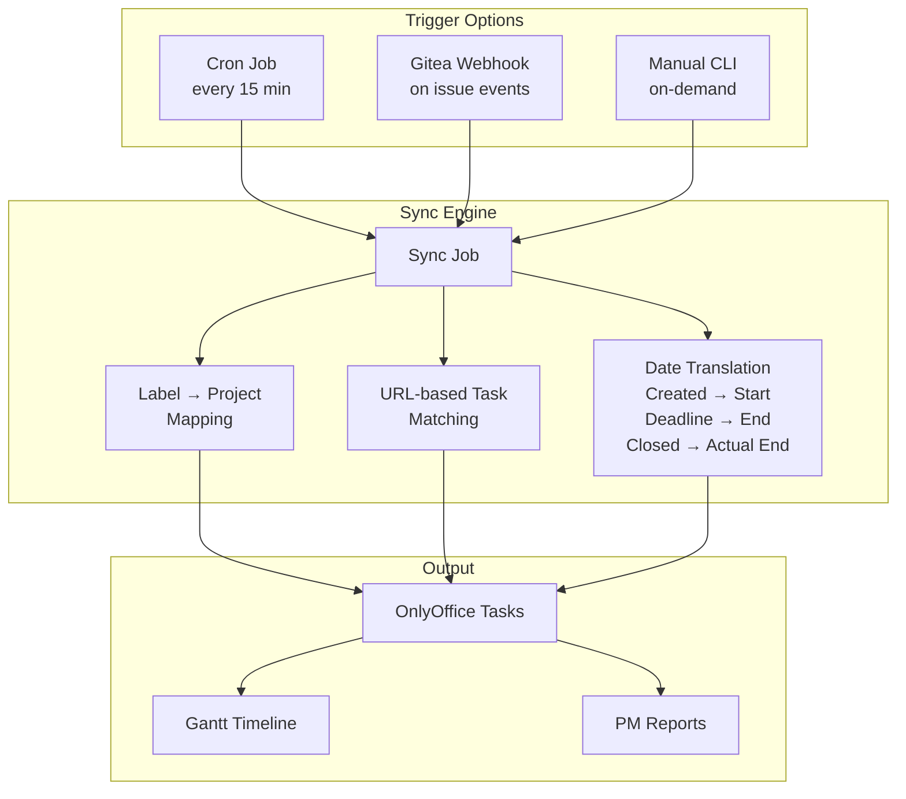

# go-onlyoffice

[](https://pkg.go.dev/github.com/eslider/go-onlyoffice)
[](https://opensource.org/licenses/MIT)
[](https://go.dev)
[](https://github.com/eSlider/go-onlyoffice/actions/workflows/test.yml)
[](https://github.com/eSlider/go-onlyoffice/releases)
[](https://github.com/eSlider/go-onlyoffice/stargazers)

Go client library for the [OnlyOffice](https://www.onlyoffice.com/) Project Management API — manage projects, tasks, subtasks, milestones, and users programmatically.

Pairs with [go-gitea-helpers](https://github.com/eSlider/go-gitea-helpers) to bridge developer issue trackers with CRM-grade project management for Gantt charts, resource planning, and executive reporting.

## Architecture


```mermaid
graph TB
    subgraph "Developer Tools"
        GIT["Gitea / GitHub<br/>Issues, PRs, Milestones"]
    end

    subgraph "go-onlyoffice"
        CL["Client"]
        AUTH["Auth<br/>Token-based"]
        PRJ["Projects"]
        TSK["Tasks & Subtasks"]
        MS["Milestones"]
        USR["Users"]
    end

    subgraph "OnlyOffice CRM"
        GANTT["Gantt Charts"]
        PLAN["Project Planning"]
        RPT["Reports & Dashboards"]
        PM["PM Workflow"]
    end

    GIT -->|"sync issues"| CL
    CL --> AUTH
    AUTH --> PRJ
    AUTH --> TSK
    AUTH --> MS
    AUTH --> USR

    PRJ --> GANTT
    TSK --> GANTT
    MS --> PLAN
    TSK --> RPT
    PRJ --> PM
```

## The Problem: Developers vs. Project Managers


```mermaid
graph LR
    subgraph "Engineering World"
        DEV["Developers"]
        GITEA["Gitea / GitHub<br/>Issues & PRs"]
        CODE["Code Reviews"]
    end

    subgraph "Management World"
        PM["Project Managers"]
        OO["OnlyOffice CRM<br/>Gantt · Planning · Reports"]
        EXEC["Executives<br/>Status Reports"]
    end

    DEV -->|"create issues"| GITEA
    GITEA -.->|"❌ invisible"| PM
    PM -->|"manual copy"| OO
    OO --> EXEC

    style GITEA fill:#f96,stroke:#333
    style OO fill:#69f,stroke:#333
```

**Without sync:** Project managers manually copy issue titles, deadlines, and status from Gitea into OnlyOffice. Developers don't update the CRM. Gantt charts rot. Reports lie.

**With sync:** Issues flow automatically from Gitea to OnlyOffice with start dates, deadlines, and status. PMs get live Gantt charts. Developers keep working in Git.


```mermaid
graph LR
    subgraph "Engineering World"
        DEV["Developers"]
        GITEA["Gitea / GitHub"]
    end

    subgraph "Sync Bridge"
        SYNC["go-onlyoffice<br/>+ go-gitea-helpers"]
    end

    subgraph "Management World"
        OO["OnlyOffice CRM"]
        GANTT["Gantt Charts ✓"]
        RPT["Reports ✓"]
    end

    DEV -->|"create/close issues"| GITEA
    GITEA -->|"auto-sync"| SYNC
    SYNC -->|"create/update tasks"| OO
    OO --> GANTT
    OO --> RPT

    style SYNC fill:#4a4,stroke:#333,color:#fff
```

## Installation

```bash
go get github.com/eslider/go-onlyoffice
```

For Gitea sync (optional):

```bash
go get github.com/eslider/go-gitea-helpers
```

## Quick Start

### Connect and List Projects

```go
client := onlyoffice.NewClient(onlyoffice.GetEnvironmentCredentials())

projects, _ := client.GetProjects()
for _, p := range projects {
    fmt.Printf("[%d] %s — %d tasks\n", *p.ID, *p.Title, safeInt(p.TaskCountTotal))
}
```

### Create a Project with Tasks and Deadlines

```go
// Create a project
project, _ := client.CreateProject(onlyoffice.NewProjectRequest{
    Title:       "Q1 2026 Release",
    Description: "Backend API v2 + mobile app redesign",
})

// Create tasks with start/end dates (for Gantt chart)
client.CreateProjectTask(onlyoffice.NewProjectTaskRequest{
    ProjectId:   *project.ID,
    Title:       "Design API schema",
    Description: "OpenAPI 3.1 spec for all endpoints",
    StartDate:   onlyoffice.Time(time.Now()),
    Deadline:    onlyoffice.Time(time.Now().AddDate(0, 0, 14)),
    Priority:    1, // High
})

client.CreateProjectTask(onlyoffice.NewProjectTaskRequest{
    ProjectId:   *project.ID,
    Title:       "Implement auth service",
    Description: "JWT + OAuth2 + refresh tokens",
    StartDate:   onlyoffice.Time(time.Now().AddDate(0, 0, 14)),
    Deadline:    onlyoffice.Time(time.Now().AddDate(0, 1, 0)),
})
```

### List and Filter Tasks

```go
// Get all tasks for a project
tasks, _ := client.GetTasks(onlyoffice.NewProjectGetTasksRequest(*project.ID))

for _, t := range tasks {
    status := "open"
    if t.Status != nil && *t.Status == onlyoffice.ProjectTaskStatusClosed {
        status = "closed"
    }
    fmt.Printf("  [%s] %s", status, *t.Title)
    if t.Deadline != nil {
        fmt.Printf(" (due: %s)", t.Deadline.Format("2006-01-02"))
    }
    fmt.Println()
}
```

### Update Task Status and Dates

```go
// Close a task and set actual end date
client.UpdateProjectTask(onlyoffice.ProjectTaskUpdateRequest{
    ID:       taskID,
    Title:    "Design API schema",
    Status:   onlyoffice.ProjectTaskStatusClosed,
    Deadline: &onlyoffice.Time(time.Now()),
})
```

### Get Milestones and Task Progress

```go
milestones, _ := client.GetProjectMilestones(project)
for _, ms := range milestones {
    active := int64(0)
    closed := int64(0)
    if ms.ActiveTaskCount != nil { active = *ms.ActiveTaskCount }
    if ms.ClosedTaskCount != nil { closed = *ms.ClosedTaskCount }
    total := active + closed

    fmt.Printf("Milestone: %s — %d/%d tasks done", *ms.Title, closed, total)
    if ms.Deadline != nil {
        fmt.Printf(" (deadline: %s)", ms.Deadline.Format("2006-01-02"))
    }
    fmt.Println()
}
```

---

## Use Case: Gitea → OnlyOffice Sync

The primary use case is **bridging developer workflows with project management**. Developers create issues in Gitea; a sync job automatically mirrors them as OnlyOffice tasks with proper start/end dates, enabling PMs to work with Gantt charts without developers leaving their Git workflow.

### Sync Flow


```mermaid
sequenceDiagram
    participant Dev as Developer
    participant Gitea
    participant Sync as Sync Job
    participant OO as OnlyOffice

    Dev->>Gitea: Create issue "Add OAuth2"
    Note over Gitea: issue.Created = Feb 13<br/>issue.Deadline = Mar 1

    Sync->>Gitea: GET /repos/{org}/*/issues
    Gitea-->>Sync: issues list (paginated)

    Sync->>OO: GET /api/2.0/project/filter.json
    OO-->>Sync: projects list

    Sync->>Sync: Match Gitea labels → OO projects

    alt Issue not yet in OnlyOffice
        Sync->>OO: POST /api/2.0/project/{id}/task.json
        Note over OO: Task created:<br/>Start: Feb 13, End: Mar 1<br/>Description includes Gitea URL
    else Issue already synced
        Sync->>OO: PUT /api/2.0/project/task/{id}.json
        Note over OO: Title, status, dates updated
    end

    Dev->>Gitea: Close issue "Add OAuth2"
    Sync->>OO: PUT status → Closed
    Note over OO: Gantt chart updates automatically
```

### Sync Example

```go
package main

import (
    "fmt"
    "log"
    "os"
    "strings"

    gitea "github.com/eslider/go-gitea-helpers"
    onlyoffice "github.com/eslider/go-onlyoffice"
)

func main() {
    // Connect to both services
    oo := onlyoffice.NewClient(onlyoffice.GetEnvironmentCredentials())
    gc, _ := gitea.NewClient(gitea.GetEnvironmentConfig())
    owner := os.Getenv("GITEA_OWNER")

    // Load all Gitea issues and OnlyOffice projects
    repos, _ := gc.GetAllReposIssues(owner)
    projects, _ := oo.GetProjects()

    for repoName, repo := range repos {
        // Find matching OnlyOffice project by name
        project := projects.Get(repoName)
        if project == nil {
            fmt.Printf("SKIP %s (no matching OO project)\n", repoName)
            continue
        }

        // Load existing tasks
        tasks, _ := oo.GetTasks(onlyoffice.NewProjectGetTasksRequest(*project.ID))

        for _, issue := range repo.Issues {
            // Check if issue is already synced (URL in description)
            existing := findSyncedTask(tasks, issue.HTMLURL)

            if existing != nil {
                // Update existing task
                status := onlyoffice.ProjectTaskStatusOpen
                if issue.State == "closed" {
                    status = onlyoffice.ProjectTaskStatusClosed
                }

                oo.UpdateProjectTask(onlyoffice.ProjectTaskUpdateRequest{
                    ID:        *existing.ID,
                    Title:     issue.Title,
                    Status:    status,
                    StartDate: timePtr(onlyoffice.Time(issue.Created)),
                    Deadline:  deadlineFromIssue(issue),
                })
                fmt.Printf("  UPDATED: %s\n", issue.Title)
            } else {
                // Create new task
                status := onlyoffice.ProjectTaskStatusOpen
                if issue.State == "closed" {
                    status = onlyoffice.ProjectTaskStatusClosed
                }

                oo.CreateProjectTask(onlyoffice.NewProjectTaskRequest{
                    ProjectId:   *project.ID,
                    Title:       issue.Title,
                    Description: issue.Body + "\n\nURL:" + issue.HTMLURL,
                    StartDate:   onlyoffice.Time(issue.Created),
                    Deadline:    *deadlineFromIssue(issue),
                    Status:      status,
                })
                fmt.Printf("  CREATED: %s\n", issue.Title)
            }
        }
    }
}

// findSyncedTask checks task descriptions for the Gitea issue URL.
func findSyncedTask(tasks []*onlyoffice.Task, issueURL string) *onlyoffice.Task {
    for _, t := range tasks {
        if t.Description != nil && strings.Contains(*t.Description, issueURL) {
            return t
        }
    }
    return nil
}
```

### What Project Managers Get

Once synced, OnlyOffice provides without any developer intervention:

| Feature | How It Works |
|---|---|
| **Gantt Charts** | Tasks have `StartDate` and `Deadline` from Gitea issue created/due dates |
| **Status Tracking** | Open/closed status mirrors Gitea issue state in real time |
| **Milestone Planning** | Gitea milestones map to OnlyOffice milestones with progress % |
| **Resource Allocation** | Task assignees sync so PMs see who's working on what |
| **Sprint Reports** | Filter by date range to generate sprint/release reports |
| **Cross-Repo View** | All repos' issues appear as tasks in a unified project board |
| **Executive Dashboards** | Project progress, overdue tasks, team workload at a glance |

### Recommended Sync Architecture


```mermaid
graph TB
    subgraph "Trigger Options"
        CRON["Cron Job<br/>every 15 min"]
        HOOK["Gitea Webhook<br/>on issue events"]
        CLI["Manual CLI<br/>on-demand"]
    end

    subgraph "Sync Engine"
        S["Sync Job"]
        MAP["Label → Project<br/>Mapping"]
        MATCH["URL-based Task<br/>Matching"]
        DATE["Date Translation<br/>Created → Start<br/>Deadline → End<br/>Closed → Actual End"]
    end

    subgraph "Output"
        OO["OnlyOffice Tasks"]
        GANTT["Gantt Timeline"]
        REP["PM Reports"]
    end

    CRON --> S
    HOOK --> S
    CLI --> S

    S --> MAP
    S --> MATCH
    S --> DATE

    MAP --> OO
    MATCH --> OO
    DATE --> OO
    OO --> GANTT
    OO --> REP
```

---

## Use Case: Task Lifecycle Management

### Creating Tasks with Full Metadata

```go
task, _ := client.CreateProjectTask(onlyoffice.NewProjectTaskRequest{
    ProjectId:   projectID,
    Title:       "Implement payment gateway",
    Description: "Integrate Stripe API for subscription billing",
    StartDate:   onlyoffice.Time(time.Date(2026, 3, 1, 0, 0, 0, 0, time.UTC)),
    Deadline:    onlyoffice.Time(time.Date(2026, 3, 15, 0, 0, 0, 0, time.UTC)),
    Priority:    1, // High
    MilestoneId: milestoneID,
    Notify:      true,
})
```

### Tracking Task Progress

```go
tasks, _ := client.GetTasks(onlyoffice.NewProjectGetTasksRequest(projectID))

open, closed := 0, 0
var overdue []*onlyoffice.Task

for _, t := range tasks {
    if t.Status != nil && *t.Status == onlyoffice.ProjectTaskStatusClosed {
        closed++
    } else {
        open++
        if t.Deadline != nil && t.Deadline.Before(time.Now()) {
            overdue = append(overdue, t)
        }
    }
}

fmt.Printf("Progress: %d/%d done (%.0f%%)\n", closed, open+closed,
    float64(closed)/float64(open+closed)*100)

if len(overdue) > 0 {
    fmt.Printf("⚠ %d overdue tasks:\n", len(overdue))
    for _, t := range overdue {
        fmt.Printf("  - %s (due: %s)\n", *t.Title, t.Deadline.Format("2006-01-02"))
    }
}
```

### Subtask Management

Tasks support subtasks for breaking work into smaller pieces:

```go
type Task struct {
    ID           *int          `json:"id"`
    Title        *string       `json:"title"`
    StartDate    *time.Time    `json:"startDate"`
    Deadline     *time.Time    `json:"deadline"`
    Description  *string       `json:"description"`
    Priority     *int          `json:"priority"`       // High=1, Normal=0, Low=-1
    Status       *ProjectTaskStatus `json:"status"`    // Open=1, Closed=2
    Subtasks     []any         `json:"subtasks"`
    MilestoneID  *int64        `json:"milestoneId"`
    Responsibles []*User       `json:"responsibles"`   // Assigned team members
    // ... timestamps, permissions
}
```

---

## API Reference

### Client

| Function | Description |
|---|---|
| `NewClient(credentials)` | Create a new API client |
| `GetEnvironmentCredentials()` | Load from `ONLYOFFICE_*` env vars |
| `Auth(credentials)` | Authenticate and get token |
| `Query(request, result)` | Execute raw API request |

### Projects

| Method | Description |
|---|---|
| `GetProjects()` | List all projects |
| `CreateProject(req)` | Create a new project |
| `UpdateProject(req)` | Update project details |
| `DeleteProject(id)` | Delete a project |
| `GetProjectMilestones(project)` | Get milestones with task counts |

### Tasks

| Method | Description |
|---|---|
| `GetTasks(req)` | List tasks with filtering |
| `CreateProjectTask(req)` | Create task with dates, priority, milestone |
| `UpdateProjectTask(req)` | Update title, status, dates, priority |

### Task Fields for Gantt

| Field | Type | Purpose |
|---|---|---|
| `StartDate` | `*time.Time` | Gantt bar start |
| `Deadline` | `*time.Time` | Gantt bar end |
| `Status` | `ProjectTaskStatus` | Open (1) / Closed (2) |
| `Priority` | `*int` | High (1) / Normal (0) / Low (-1) |
| `MilestoneID` | `*int64` | Groups tasks under milestones |
| `Responsibles` | `[]*User` | Assigned team members |
| `Subtasks` | `[]any` | Sub-items within a task |

### Users

| Method | Description |
|---|---|
| `GetUsers()` | List all users with profiles |

### Helper Types

| Type | Description |
|---|---|
| `Projects` | `[]*Project` with `.Get(title)` lookup |
| `Time` | `time.Time` wrapper with OnlyOffice JSON format |
| `Task.GetGiteaIssueLink()` | Extract Gitea URL from task description |

### Calendar, CRM, Subtasks, File upload (v0.2+)

Since v0.2 the library also exposes OnlyOffice Workspace surfaces beyond
Projects: Calendar events, CRM (Contacts, Companies, Opportunities, Cases,
Tasks, History notes) and opportunity file uploads. These helpers return
untyped `map[string]any` for flexibility; callers that need typed structs
should use the typed Project/Task API above.

```go
client := onlyoffice.NewClient(onlyoffice.GetEnvironmentCredentials())
client.SetDefaults(onlyoffice.GetEnvironmentDefaults()) // optional
ctx := context.Background()

// Calendar
events, _ := client.ListEvents(ctx, "2025-01-01", "2025-12-31")
client.AddEvent(ctx, "", "Interview", "2025-06-10T10:00:00Z", "2025-06-10T11:00:00Z", "", false)

// CRM
deals, total, _ := client.ListOpportunities(ctx, 50, 0)
company, _ := client.FindCompany(ctx, "ACME")

// Subtasks (form-encoded)
client.AddSubtask(ctx, "4242", "Prepare CV")
```

### oo (bundled CLI)

A ready-to-use [Cobra](https://github.com/spf13/cobra) CLI wrapping the
library lives under [`cmd/oo`](cmd/oo/). The command tree is **subject-based**,
mirroring the [`tea`](https://gitea.com/gitea/tea) CLI:

```bash
go install github.com/eslider/go-onlyoffice/cmd/oo@latest

# Global: every list-style command takes -o table|json (default: table)
oo whoami
oo users list
oo calendar events --start 2026-04-24 --end 2026-05-01
oo projects list
oo projects get 33
oo tasks list --all --verbose
oo tasks subtask add 4242 "Prepare CV"
oo persons create --first Jane --last Doe --email jane@example.com
oo companies create --name "Acme GmbH" --website https://acme.com
oo opportunities list
oo opportunities stages
oo cases list
oo crm-tasks categories
oo applications sync --path ./applications/2026 --apply
```

### office (TUI)

Terminal UI for browsing OnlyOffice Workspace — module tree (left), selectable
lists (center), and markdown preview (right). Uses the same `.env` credentials
as `oo`. Lives under [`cmd/office`](cmd/office/).

```bash
go install github.com/eslider/go-onlyoffice/cmd/office@latest
office
```

| Key | Action |
|---|---|
| `Tab` | Switch pane (menu → list → preview) |
| `↑↓` / `j` / `k` | Navigate |
| `Space` / `Enter` | Toggle selection on list row |
| `Enter` | Load preview for focused row |
| `r` | Refresh current list |
| `q` | Quit |

Optional env for DOCX preview via Document Server (see [`.env.example`](.env.example)):

```bash
ONLYOFFICE_DOCS_URL=https://docs.example.com
ONLYOFFICE_DOCS_SECRET=…   # when JWT signing is enabled
```

Spreadsheet files: inline CSV/JSON preview in the right pane; install
[`vex`](https://github.com/CodeOne45/vex-tui) on `PATH` for full-screen
xlsx/csv viewing (`v` on a file row — coming in next iteration).

Integration tests for list loaders:

```bash
go test -tags=integration ./cmd/office/fetch/...
```

**Project / task documents (`oo`):**

```bash
# Project Documents (files module)
oo projects files list 33
oo projects files upload 33 ./notes.md
oo projects files download 12345 --to ./copy.md
oo projects files rename 12345 notes-v2.md
oo projects files delete 12345
oo tasks files list 208
oo tasks files upload 208 ./cv.pdf
oo tasks files detach 208 12345
```

| Subject | Verbs |
|---|---|
| `calendar` | `list`, `events`, `add`, `delete` |
| `projects` | `list`, `get`, `milestones`, `create`, `update`, `delete`, **`files`** (`list`, `upload`, `download`, `rename`, `delete`) |
| `tasks` | `list`, `get`, `create`, `update`, `delete`, `subtask add`, **`files`** (`list`, `upload`, `detach`) |
| `users` | `list`, `self` (alias: `oo whoami`) |
| `contacts` | `list`, `get`, `delete`, `info-add` |
| `persons` | `list` (filtered), `create`, `delete` |
| `companies` | `list` (filtered), `create`, `delete` |
| `contacts` | `list`, `get`, `delete`, `info-add`, `dedupe-info` |
| `persons` | `list`, `create`, `delete`, `dedupe` |
| `companies` | `list`, `create`, `delete`, `dedupe`, `dedupe-persons` |
| `opportunities` | `list`, `get`, `create`, `delete`, `stages`, `member-add`, `dedupe`, `dedupe-members`, `fix-titles` |
| `crm` | `cleanup` |
| `mails` | `accounts`, `folders`, `list`, `get`, `delete` |
| `cases` | `list`, `create`, `delete`, `member-add` |
| `crm-tasks` | `list`, `create`, `delete`, `categories` |
| `applications` | `sync` |

The CLI reads only `.env` from the current working directory (godotenv is a
CLI-only concern — the library itself never loads dotfiles).

Canonical `ONLYOFFICE_*` variables win over aliases. For produktor.io operator
files, `OO_URL` / `OO_USER` / `OO_PASS` are accepted as CLI-only aliases for
`ONLYOFFICE_URL` / `ONLYOFFICE_USER` / `ONLYOFFICE_PASS`.

Run `oo --help` or `oo <subject> --help` for the full command reference.

> **0.5.0 migration note:** the command tree was flattened per-subject. Old
> flat names (`oo cal-events`, `oo task-list`, `oo crm-contacts`,
> `oo applications-sync`, …) were replaced by subject-based equivalents
> (`oo calendar events`, `oo tasks list`, `oo contacts list`,
> `oo applications sync`). Flags on leaf commands are unchanged.

## oo CLI use cases

The `oo` binary is the day-to-day operator interface. It loads credentials from
`.env` in the **current working directory** (copy from [`.env.example`](.env.example)):

```bash
cp .env.example .env
# ONLYOFFICE_URL=https://office.example.com
# ONLYOFFICE_USER=you@example.com
# ONLYOFFICE_PASS=…

go install github.com/eslider/go-onlyoffice/cmd/oo@latest
oo whoami
```

Every list command accepts `-o table` (default) or `-o json` for scripting.

### CRM cleanup after imports or sync drift

**Problem:** Duplicate companies (`Acme` / `ACME GmbH`), persons created twice,
the same email on a contact three times, deals titled ` @ 711media`, or the same
HR contact linked to a deal twice.

**One-shot fix** — runs every dedupe pass in order:

```bash
oo crm cleanup -o json
```

Steps inside `crm cleanup`:

| Step | What it does |
|------|----------------|
| `companies` | Merge companies with the same normalized name (slogan variants like `Affirm` / `Affirm — Fraud Engineering` count as one) |
| `persons` | Merge duplicate persons globally (same first+last) |
| `company-persons` | Merge duplicate persons under each company |
| `contact-info` | Remove duplicate email/phone/website rows |
| `opportunity-members` | Drop duplicate contacts on the same deal |
| `opportunities` | Merge duplicate deals by title |
| `fix-titles` | Repair malformed titles (` @ Company` → `Company`) |

**Targeted passes** when you only want one kind of fix:

```bash
# Duplicate company records
oo companies dedupe

# Same person entered twice under one employer
oo companies dedupe-persons

# Global person duplicates (same name, different ids)
oo persons dedupe

# Repeated email/phone rows on contacts
oo contacts dedupe-info

# Two deals with the same title
oo opportunities dedupe

# Same contact attached twice to one deal (common after applications sync)
oo opportunities dedupe-members

# Titles like " @ 711media" or extra whitespace
oo opportunities fix-titles
```

**Deal grouping flag** — when the same role at the same company created
separate deals (`Engineer @ Acme` vs `Engineer`):

```bash
oo opportunities dedupe --ignore-company-suffix
oo crm cleanup --ignore-company-suffix
```

**Inspect before/after:**

```bash
oo opportunities list --count 200 | grep -i 711media
oo contacts get 857 -o json
oo crm cleanup -o json
```

### Job applications → CRM (`applications sync`)

**Problem:** You keep CVs in a folder tree (`applications/2026/Acme/README.md`)
and want companies, persons, deals, and history notes in OnlyOffice without
re-typing.

**Dry-run first** (default — prints what would happen, writes nothing):

```bash
oo applications sync --path ./applications/2026 --verbose
```

**Apply** when the preview looks right:

```bash
oo applications sync --path ./applications/2026 --apply --verbose
```

Each `README.md` is parsed for company, role, email, phone, LinkedIn, etc.
The sync creates or finds contacts, opens a deal, adds members, and appends a
history note. Re-running is safe: duplicate members and duplicate deal titles
are skipped when already present.

**After a large sync**, run CRM cleanup to collapse duplicates introduced by
repeated runs or manual edits:

```bash
oo applications sync --path ./applications/2026 --apply
oo crm cleanup -o json
```

### Workspace mail (`oo mails`)

**Problem:** Mail lives in OnlyOffice Mail (`/addons/mail/#inbox`), bound to your
portal account — not a separate archive service. You want to list, read, or
remove messages from the shell.

Uses the same `ONLYOFFICE_*` credentials as every other `oo` command.

```bash
# Which mailbox is linked?
oo mails accounts

# Folder counters (inbox unread, trash size, …)
oo mails folders

# Latest inbox messages (API returns 25 per page; --limit paginates automatically)
oo mails list --folder inbox --limit 50

# Page through older mail
oo mails list --folder inbox --limit 100 --offset 100

# Other folders
oo mails list --folder sent --limit 20
oo mails list --folder spam --limit 100

# Read full message (subject, htmlBody, attachments metadata)
oo mails get 5664 -o json | jq '{subject, from, to, date}'

# Remove one or more messages (server moves to trash or deletes per Mail rules)
oo mails delete 5664
oo mails delete 5664 5663 5661
```

**Table output** splits the `from` header into `fromName` and `fromAddress`
(e.g. `Bitfinex` + `no-reply@bitfinex.com`). **JSON output** returns the raw
API payload.

**Scripting example** — export today's inbox subjects:

```bash
oo mails list --folder inbox --limit 200 -o json \
  | jq -r '.[] | "\(.id)\t\(.subject)"'
```

### Contacts, companies, and deals (everyday CRM)

```bash
# Search companies
oo companies list --search acme

# Create company + person with primary email
oo companies create --name "Acme GmbH" --website https://acme.com
oo persons create --first Jane --last Doe --email jane@acme.com --company-id 42

# Attach email or LinkedIn to existing contact
oo contacts info-add 42 --type Email --value jane@acme.com --primary

# Pipeline overview
oo opportunities list --count 100
oo opportunities stages
oo opportunities get 231 -o json
```

### Calendar and project ops

```bash
# Next week's events
oo calendar events --start 2026-06-24 --end 2026-07-01

# Schedule interview block
oo calendar add "Technical interview" 2026-06-26T10:00:00Z 2026-06-26T11:00:00Z

# Attach CV to a hiring task
oo tasks files upload 208 ./cv.pdf
oo projects files list 33
```

### Suggested maintenance cadence

| When | Command |
|------|---------|
| After `applications sync --apply` | `oo crm cleanup` |
| After bulk CSV import into CRM | `oo crm cleanup` |
| Weekly inbox triage | `oo mails list --folder inbox --limit 100` |
| Before exec reporting | `oo opportunities list` + `oo projects list` |

## Environment Variables

| Variable | Description |
|---|---|
| `ONLYOFFICE_URL` (or `ONLYOFFICE_HOST`) | OnlyOffice instance URL |
| `ONLYOFFICE_USER` (or `ONLYOFFICE_NAME`) | Login email or username |
| `ONLYOFFICE_PASS` (or `ONLYOFFICE_PASSWORD`) | Password |
| `ONLYOFFICE_CALENDAR_ID` | Default calendar id used when omitted (default `1`) |
| `ONLYOFFICE_PROJECT_ID` | Default project id used when omitted (default `33`) |
| `OO_URL`, `OO_USER`, `OO_PASS` | CLI-only produktor.io aliases mapped to `ONLYOFFICE_URL`, `ONLYOFFICE_USER`, `ONLYOFFICE_PASS` |

Mail, CRM cleanup, and applications sync are documented in [oo CLI use cases](#oo-cli-use-cases) above.

### CI / releases

GitHub Actions (pattern from [`eSlider/go-config`](https://github.com/eSlider/go-config)):

| Workflow | Trigger | Purpose |
|---|---|---|
| `test.yml` | push / PR | `go vet`, unit tests, build `oo` + `office` |
| `release-please.yml` | push to `main` | semver PR from conventional commits |
| `release.yml` | tag `v*` | GoReleaser cross-platform `oo` + `office` binaries |

Repo setting required once: **Settings → Actions → General → Allow GitHub Actions to create and approve pull requests**.

Merge the release-please PR to tag a version; GoReleaser publishes assets to [GitHub Releases](https://github.com/eSlider/go-onlyoffice/releases).

## Examples

| Example | Description |
|---|---|
| [basic](examples/basic/) | List projects and users |
| [calendar](examples/calendar/) | List calendars and events, create a new event |
| [crm](examples/crm/) | List contacts and opportunities, add company/deal/history note |
| [subtasks](examples/subtasks/) | Create a parent task and attach subtasks |
| [`cmd/oo`](cmd/oo/) | Full-featured CLI using all modules |
| [`cmd/office`](cmd/office/) | Terminal UI — browse Workspace with markdown preview |

## Related Libraries

| Library | Description |
|---|---|
| [go-gitea-helpers](https://github.com/eSlider/go-gitea-helpers) | Gitea pagination helpers for issue/repo fetching |
| [go-matrix-bot](https://github.com/eSlider/go-matrix-bot) | Matrix bot with OnlyOffice task creation from chat |
| [go-trade](https://github.com/eSlider/go-trade) | Unified trade data model across exchanges |

## License

[MIT](LICENSE)
